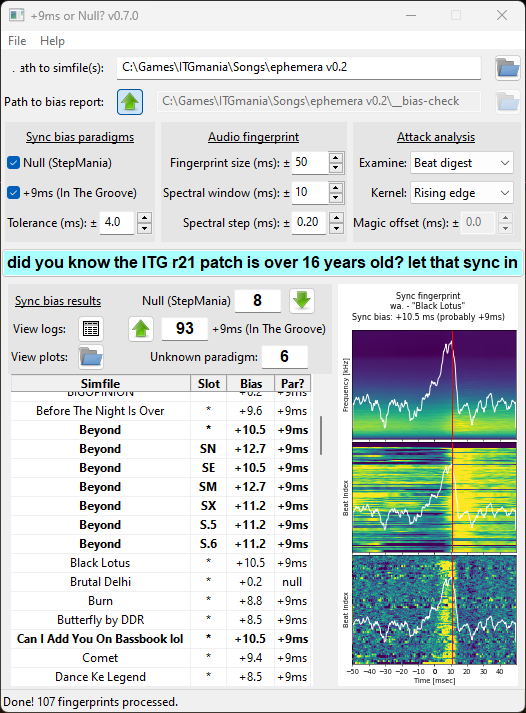

# +9ms or Null?
## +9ms or Null? is a StepMania simfile unbiasing utility.

This utility can determine whether the sync bias of a simfile or a pack is +9ms (In The Groove) or null (general StepMania). A future version will also offer to unify it under one of those two options.

***It is not meant to perform a millisecond-perfect sync!*** Please don't depend on the exact value you get from it. Instrument attacks vary significantly, and the algorithm I'm using is not smart enough to know what to focus on.

You can read more about the origins of the +9ms sync bias here:
- [Club Fantastic Wiki's explanation](https://wiki.clubfantastic.dance/Sync#itg-offset-and-the-9ms-bias)
- [Ash's discussion of solutions @ meow.garden](https://meow.garden/killing-the-9ms-bias)

Needless to say, it's about time to put the nine millisecond nail in this coffin.

## How does it work?
I'll get into more detail on this elsewhere, but the seed concept is a visual representation first implemented (as far as I can tell) by beware, of beware's DDR Extreme fame.
1. Identify the time that each beat occurs - I used ashastral's excellent [`simfile`](https://simfile.readthedocs.io/en/latest/) library to do this.
1. Load the audio (`pydub`) and calculate its spectrogram (`numpy` & `scipy`).
1. Snip a small window around each beat time out of the spectrogram and stack them in some way - this becomes the **sync fingerprint**.
    - Time will always be on the X axis for this exercise.
    - **Beat digest**: Flatten the frequencies (after applying a simple filter to avoid ultra-high/-low bands) and let the Y coordinate be the index of the beat. The most helpful visual, and the original inspiration.
    - **Accumulator**: Sum up the window and keep the frequency of the sound energy as the Y coordinate. Not as useful but a good sanity check.
1. Apply a time-domain convolution to identify the audio feature the simfile is sync'd to.
    - **Rising edge**: This one seems like the most reliable.
    - **Local loudness**: A more naive approach - and a bit easier to fool. But if you want to see what it does, it's here.
1. Take the time at the highest response of the convolution as the bias of the simfile's sync.
1. Decide whether the simfile was sync'd to the +9ms (In The Groove) or the null (StepMania) paradigm, or to neither in particular, by checking whether that bias lies within a small interval around +9ms or 0ms, respectively.
1. Visualize it all for the user (`matplotlib`).

## How to use

### Setting up the project
You have a couple options:
- Clone the repository and use `poetry` to set up the `nine-or-null` package.
  1. `poetry install`
  1. (CLI) `poetry run python -m nine_or_null "C:\Games\ITGmania\Songs\pack-name"`
  1. (GUI) `poetry run python -m nine_or_null.gui` or `poetry run python -m nine_or_null`
- Download the executable (made with PyInstaller).

### Command-line interface (CLI)
It's not as configurable as the GUI yet but that's coming soon. For now you can just call the main routine of the `nine_or_null` package, and pass it the full path to the pack as a command-line argument. If you call it without a path, it'll invoke the GUI. (Use `-h` for more info about what options are available.)

### Graphical user interface (GUI)

The intended workflow:
1. Select the path to the pack or simfile you want to check using the directory button in the upper-right corner (or manually enter in the text box next to it).
1. You can probably leave all the parameters alone for now.
1. Press the big button to **let that sync in**.
1. Let the GUI do some heavy lifting. It'll probably take a few seconds per simfile with the default settings - and it's probably gonna act like it's unresponsive. (There's some threading I could do to fix that, but I'll get to that later.)
1. Watch the status bar, results table, and sync fingerprint plots for updates.
    - From top to bottom, the plots represent the frequency domain accumulator, the beat digest, and the convolved fingerprint.
    - The red line indicates where the maximum kernel response lies, and thus the sync bias of this simfile. The white line is the kernel response for the whole fingerprint vs. local time.
    - If split timing is discovered, the "slot" column in the table will also have a value, indicating whether the entry represents the base simfile (*) or a specific chart (SX, CSP, etc.).
1. Once the status bar indicates the job is "Done!", the number of paradigm-adherent simfiles or charts will appear above the results table.
1. Feel free to "View logs", "View plots", or double-click on individual entries in the results table to reload plots in the neighboring pane.
1. Use the two arrows above the paradigm counts to batch adjust the sync bias on simfiles or charts (either from +9ms to null, or vice versa). ***Again, not a millisecond-accurate sync utility! It's only offering to add or subtract 9ms.***
    - If you don't want to adjust *all* the matching charts, you can (multi-)select rows in the results table while in GUI mode, and the bias adjustment will only apply to the subset of those that aren't already sync'd to the desired paradigm.

(If your computer starts really chugging during the bias check, bump the "Spectral step" up or the "Spectral window" down - both of these sacrifice a bit of spectrogram precision but the results are still generally good.)

## Future plans
- Code cleanup
- Performance optimization (need to move to MVC model :weary:)
- If a straight vertical line "fit" can identify bias, then a line fit with both local time and beat index dependence could also identify sync drift...hmm...

----
Also there's a little broom closet in this repo where I was doing some testing on rhythmic complexity algorithms. Don't worry about that for now ;)