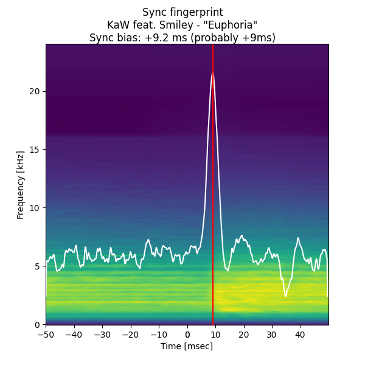
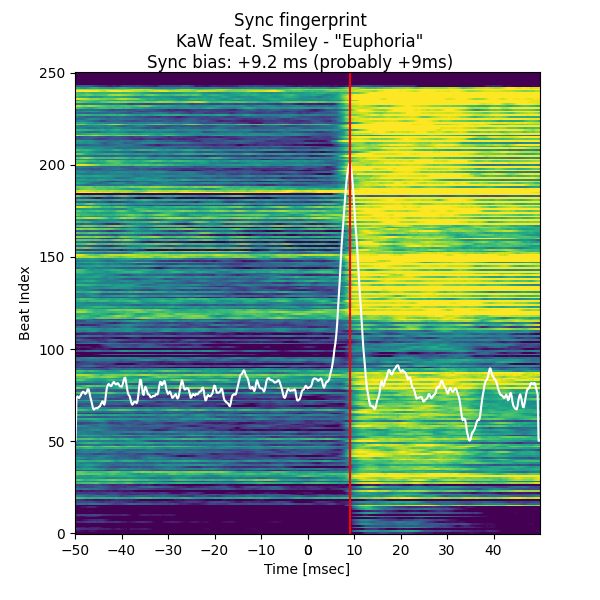
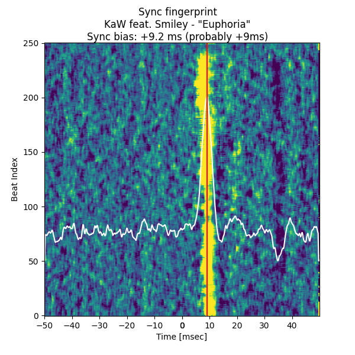
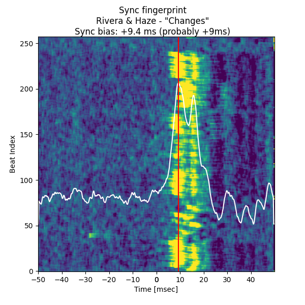
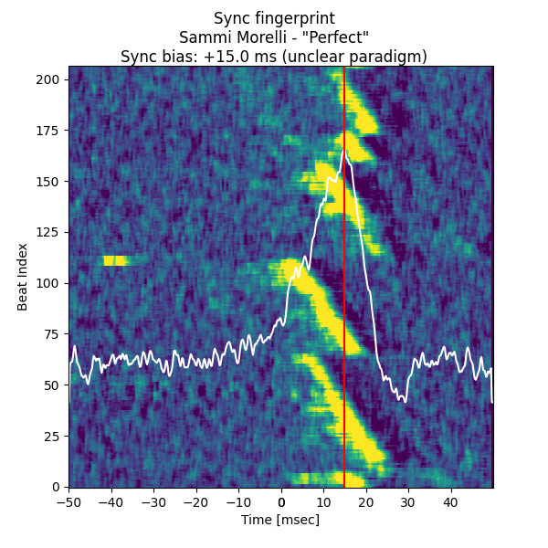

# +9ms or Null?
## +9ms or Null? is a StepMania simfile unbiasing utility.

This utility can determine whether the sync bias of a simfile or a pack is +9ms (In The Groove) or null (general StepMania), and offers to unify it under one of those two options.

***It is not meant to perform a millisecond-perfect sync!*** Please don't depend on the exact value you get from it. Instrument attacks vary significantly, and the algorithm I'm using is not smart enough to know what to focus on.

You can read more about the origins of the +9ms sync bias here:
- [Club Fantastic Wiki's explanation](https://wiki.clubfantastic.dance/Sync#itg-offset-and-the-9ms-bias)
- [Ash's discussion of solutions @ meow.garden](https://meow.garden/killing-the-9ms-bias)

Needless to say, it's about time to put the nine millisecond nail in this coffin.

## How does it work?
I'll get into more detail on this elsewhere, but the seed concept is a visual representation first implemented (as far as I can tell) by beware, of beware's DDR Extreme fame.
1. Identify the time that each beat occurs - I used ashastral's excellent [`simfile`](https://simfile.readthedocs.io/en/latest/) library to do this.
1. Load the audio (`pydub`) and calculate its spectrogram (`numpy` & `scipy`).
1. Snip a small window around each beat time out of the spectrogram and stack them in some way - this becomes the **sync fingerprint**.
    - Time will always be on the X axis for this exercise.
    - **Beat digest**: Flatten the frequencies (after applying a simple filter to avoid ultra-high/-low bands) and let the Y coordinate be the index of the beat. The most helpful visual, and the original inspiration.
    - **Accumulator**: Sum up the window and keep the frequency of the sound energy as the Y coordinate. Not as useful but a good sanity check.
1. Apply a time-domain convolution to identify the audio feature the simfile is sync'd to.
    - **Rising edge**: This one seems like the most reliable.
    - **Local loudness**: A more naive approach - and a bit easier to fool. But if you want to see what it does, it's here.
1. Take the time at the highest response of the convolution as the bias of the simfile's sync.
1. Decide whether the simfile was sync'd to the +9ms (In The Groove) or the null (StepMania) paradigm, or to neither in particular, by checking whether that bias lies within a small interval around +9ms or 0ms, respectively.
1. Visualize it all for the user (`matplotlib`).

## How to use

### Setting up the project
You have a couple options:
- Clone the repository and use `poetry` to set up the `nine-or-null` package.
  1. `poetry install`
  1. (CLI) `poetry run python -m nine_or_null "C:\Games\ITGmania\Songs\pack-name"`
  1. (GUI) `poetry run python -m nine_or_null.gui` or `poetry run python -m nine_or_null`
- Download the executable (made with PyInstaller).

**NOTE**: `pydub`, the audio processing library I used for this utility, uses [`ffmpeg`](https://ffmpeg.org/download.html) to load audio files into memory. If the program complains about a lack of `ffmpeg`, you may need to install it and add it to your environment path; directions for this are pretty easy to find online.

### Command-line interface (CLI)
It's not as configurable as the GUI yet but that's coming soon. For now you can just call the main routine of the `nine_or_null` package, and pass it the full path to the pack as a command-line argument. If you call it without a path, it'll invoke the GUI. (Use `-h` for more info about what options are available.)

### Graphical user interface (GUI)

The intended workflow:
1. Select the path to the pack or simfile you want to check using the directory button in the upper-right corner (or manually enter in the text box next to it).
1. You can probably leave all the parameters alone for now.
1. Press the big button to **let that sync in**.
1. Let the GUI do some heavy lifting. It'll probably take a few seconds per simfile with the default settings - and it's probably gonna act like it's unresponsive. (There's some threading I could do to fix that, but I'll get to that later.)
1. Watch the status bar, results table, and sync fingerprint plots for updates.
    - From top to bottom, the plots represent the frequency domain accumulator, the beat digest, and the convolved fingerprint.
    - The red line indicates where the maximum kernel response lies, and thus the sync bias of this simfile. The white line is the kernel response for the whole fingerprint vs. local time.
    - If split timing is discovered, the "slot" column in the table will also have a value, indicating whether the entry represents the base simfile (*) or a specific chart (SX, CSP, etc.).
1. Once the status bar indicates the job is "Done!", the number of paradigm-adherent simfiles or charts will appear above the results table.
1. Feel free to "View logs", "View plots", or double-click on individual entries in the results table to reload plots in the neighboring pane.
1. Use the two arrows above the paradigm counts to batch adjust the sync bias on simfiles or charts (either from +9ms to null, or vice versa). ***Again, not a millisecond-accurate sync utility! It's only offering to add or subtract 9ms.***
    - If you don't want to adjust *all* the matching charts, you can (multi-)select rows in the results table while in GUI mode, and the bias adjustment will only apply to the subset of those that aren't already sync'd to the desired paradigm.

(If your computer starts really chugging during the bias check, bump the "Spectral step" up or the "Spectral window" down - both of these sacrifice a bit of spectrogram precision but the results are still generally good.)

## Interpreting the plots
+9ms or Null? yields three visuals for each simfile or chart sync it processes. These are presented in the lower-right pane of the GUI during operation, but you can also access them by opening the "View plots" folder, or navigating directly to the report path (indicated in the GUI text box or at the command-line output).

Some features are common among all three plots:
- The X-axis, or horizontal position, represents the time neighborhood of the downbeat according to the timing data - offset, BPMs, stops, etc. Zero on this axis is thus expected to be "on-beat" under a null sync paradigm; if your files are ITG sync'd, the attack should happen 9.0 ms to the right.
- The color of the plot represents audio level, usually after some amount of processing or averaging. Purple is the low end of the scale, yellow is high.
- The ***white squiggly line*** represents the calculation the algorithm's doing to decide where the downbeat attack lands. The highest point, indicating the maximum algorithm response, is labeled as the sync bias, and a ***red vertical line*** is drawn through it.
- The algorithm doesn't exactly match up with human perception, but it should be able to pinpoint the attack within a couple of milliseconds (thus the "tolerance" parameter).

If there's a sync that doesn't seem to line up with one of the two bias paradigms, or you doubt the result because you already know it to be on-sync, it's always worth a peek at the plots :)

### Spectrogram average
The spectrogram of each downbeat's neighborhood, stacked in 3D and averaged down to a single plot against local time (X-axis) and frequency (Y-axis). More of a sanity check - not as visually informative as the other two plots. The highest audio level should lie immediately to the right of the bias line.

### Beat digest
The frequencies in the spectrogram of each downbeat's neighborhood are flattened down, leaving a single line where audio level only corresponds to local time. Repeat this at each beat and stack the lines vertically to make this striking visual.

Y-axis now represents the "beat index". You can also consider horizontal to be "fine time" and vertical to be "coarse time" - the audio track progresses from bottom to top, and each beat should line up to the same sync bias, creating a vertical stripe or swath of yellow to the right of the red bias line.

### Convolution response
A peek into the guts of the algorithm. Without getting too much into the math, this is the step that precedes the calculation of the squiggly white line: yellow represents high algorithmic response to the audio. The horizontal position with the most response overall will be identified as the sync bias.

This is the most informative plot (imo), and can also help identify other sync issues that might be lurking:
- A narrow, sharply vertical yellow stripe represents a crisp sync - good!
    - The stripe can be a little patchy or wavy, but as long as it's strongly vertical, the sync should still feel consistent. (Different instrumentation or human performers will often cause this.)

- A tilted yellow stripe indicates that the BPM is slightly off; if the tilt shows up clearly in the fingerprint, it's probably off by at least a hundredth (0.01) or two.
    - Upward tilt to the right ↗ means the chosen BPM is too low; upward tilt to the left ↖ indicates a BPM too high.
- Large discontinuities (jumps) in the yellow stripe can indicate song cut errors, incorrect stop values, or other sudden introductions of offset.
- Of course, you might get a little from column A *and* a little from column B...

## Confidence

Not every track has a sharply defined beat throughout. Sometimes the sync fingerprint can pinpoint the attack clearly; other tracks might exhibit a lot of uncertainty, or the simfile skeleton might not define the correct BPMs. This tool is (for the moment) only interested in offset identification and adjustment, and we don't want to mess with files that are unclear - or in a state where moving the offset won't make the sync better. With that in mind, a **confidence metric** is introduced.

### What makes a good confidence metric?
What could cause the algorithm to pick an incorrect sync bias? Let's consider the following:
- How much of a clear winner is the attack time the algorithm chooses? Or, would it be hard to pick out the peak because there's high response in the neighborhood? (say, a ringing attack, or a two-part attack like a clap sound)
- Is this extra algorithmic response far enough away from the chosen attack time that it would actually impact the sync?

With that in mind, the following calculations are performed:
1. For each point in the flattened convolution response (the white squiggle in the sync fingerprint plots), measure the following:
    - *v*, the relative distance from the response's median, compared to the identified peak.
    - *d*, the time difference from the identified peak.
1. Balance these two measurements using power functions and multiply them together to calculate the "unconfidence" this point contributes. (The current confidence calculation uses *v*^4 × *d*^1.5.)
1. Sum all of these "unconfidence" values and subtract from 1 to obtain a "confidence" value.
1. Apply some perceptual scaling and express as a percentage.

The actual values returned from the confidence metric don't have an intrinsic meaning - that is, there's nothing in the plot you can point to that directly produces it - but it's expected that "messier" plots result in lower confidence, and "sharper" plots in higher confidence.

Note that a value of 100% or near-100% confidence does not mean the current sync is *correct*, just that the algorithm can't see anything in the rest of the fingerprint to convince it that the peak could possibly lie elsewhere.

The GUI includes a control to tune the minimum confidence to apply unbiasing at; it's expressed in percentage out of 100%. The CLI also offers this parameter, but in terms of proportion out of unity - for example, if the user wants to only apply unbiasing over 80% confidence, they would pass `--confidence 0.80` at the command line invocation. The CSV output also expresses the confidence as a proportion out of unity.

## Future plans
- Code cleanup
- Performance optimization (need to move to MVC model :weary:)
- Swap out `pydub` with `essentia` in streaming mode? Maybe I can get away with skipping large chunks of audio during the load step, which would save some time...
- If a straight vertical line "fit" can identify bias, then a line fit with both local time and beat index dependence could also identify sync drift...hmm...

----
Also there's a little broom closet in this repo where I was doing some testing on rhythmic complexity algorithms. Don't worry about that for now ;)